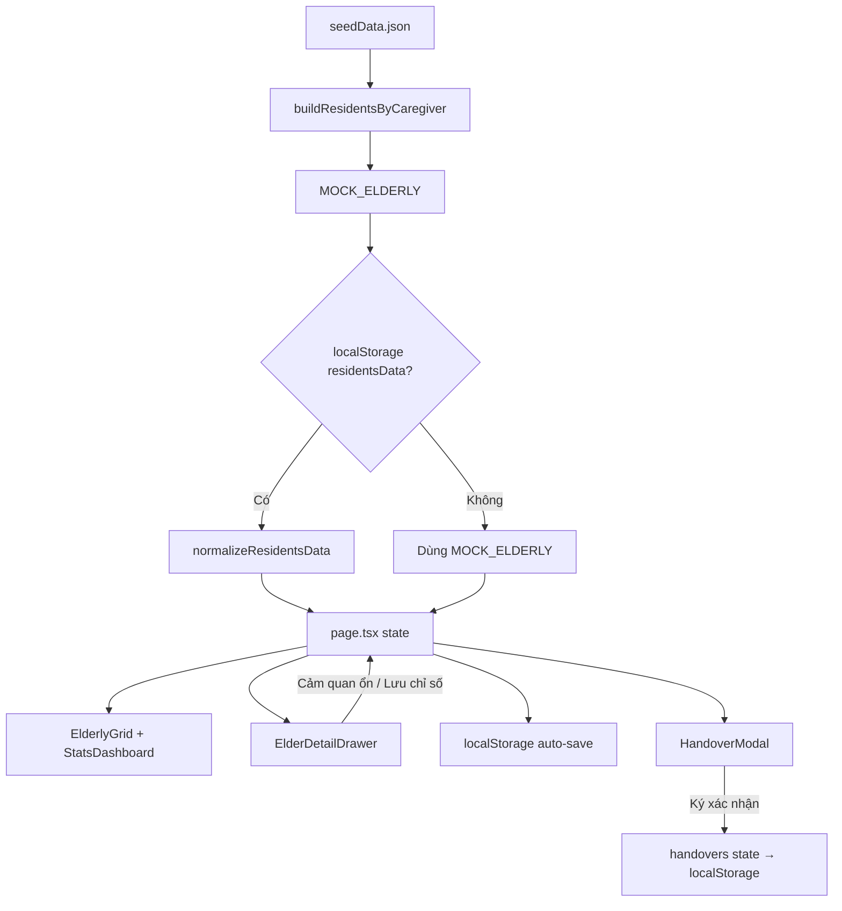

# Sổ Bàn Giao Ca Điện Tử — Dưỡng Lão Bình Mỹ

Ứng dụng web hỗ trợ **chăm sóc viên (điều dưỡng)** ghi nhận sức khỏe người cao tuổi trong ca trực, theo dõi biến động, và **bàn giao ca** có chữ ký điện tử.

---

## Mục đích

Trong mỗi ca trực, chăm sóc viên cần:

1. Biết ai cần ưu tiên theo dõi (biến động ca trước / ca hiện tại).
2. Ghi nhận chỉ số sinh tồn hoặc xác nhận cảm quan ổn định cho từng cụ.
3. Ghi chú tình trạng và hướng xử lý khi có biến động.
4. Hoàn tất ca bằng ký xác nhận bàn giao cho ca tiếp theo.

Ứng dụng hiện dùng **dữ liệu mẫu** (`seedData.json`) và lưu thay đổi vào **localStorage** trình duyệt (prototype/demo).

---

## Công nghệ

| Thành phần | Chi tiết |
|---|---|
| Framework | Next.js 16 (App Router) |
| UI | React 19, CSS tùy biến (`globals.css`, `tokens.css`) |
| Icon | lucide-react |
| Danh sách | @tanstack/react-virtual (lưới người cao tuổi) |
| Ngôn ngữ | TypeScript |

---

## Cấu trúc thư mục chính

```
src/
├── app/
│   ├── layout.tsx              # Metadata, font, import CSS, shell HTML
│   ├── page.tsx                # Trang chính — state toàn app, luồng ca trực
│   ├── tokens.css             # Biến thiết kế (design tokens)
│   └── globals.css            # Style toàn cục
├── components/
│   ├── Header                 # Thanh tiêu đề (logo + thông tin ca)
│   ├── CaregiverSelector      # Chọn nhân viên trực ca
│   ├── StatsDashboard         # Thống kê + bộ lọc trạng thái
│   ├── ElderlyGrid/Card       # Lưới + thẻ người cao tuổi
│   ├── ElderDetailDrawer      # Drawer chi tiết + form ghi nhận
│   ├── SignOffCard            # Ký bàn giao ca
│   ├── BottomNavigation       # Điều hướng mobile
│   └── CaregiverProfileSheet  # Sheet hồ sơ / đổi nhân viên (mobile)
├── modals/
│   └── HandoverModal          # Modal ký tên + xác nhận bàn giao
├── data/
│   ├── seedData.json          # Dữ liệu nền (JSON): cơ sở, CSV, người cao tuổi, lịch sử
│   └── mockData.ts            # Re-export CSV + người cao tuổi từ seed
├── types/index.ts             # Kiểu dữ liệu domain
└── utils/
    ├── loadSeedData.ts        # Đọc seed, suy trạng thái ban đầu
    ├── elderFilters.ts        # Logic lọc / phân loại trạng thái
    ├── helpers.ts             # Validate chỉ số, mức nghiêm trọng
    └── normalizeElderly.ts    # Chuẩn hóa khi nạp từ localStorage
```

---

## Mô hình dữ liệu

### Chăm sóc viên (`Caregiver`)

Mỗi CSV có: `id`, `name`, `avatar`, `facility`, `area` (Khu A/B/C), `shift` (Sáng / Chiều / Đêm), `phone`.

Demo có 3 ca: **Nguyễn Thị Mai** (Khu A, Sáng), **Trần Văn Hùng** (Khu B, Chiều), **Lê Mỹ Linh** (Khu A, Đêm).

### Người cao tuổi (`Elderly`)

Thông tin hành chính (tên, tuổi, giường, bệnh nền, liên hệ khẩn cấp…) và **trạng thái ca trực**:

| Trường | Ý nghĩa |
|---|---|
| `status` | `stable` · `logged` · `need_attention` |
| `vitalsMeasuredInShift` | Đã đo/nhập chỉ số trong ca này chưa |
| `hasFluctuation` | Biến động sức khỏe **trong ca hiện tại** |
| `recentFluctuationHistory` | Biến động từ **ca trước**, chưa ghi nhận ca mới |
| `lastVitals` | Chỉ số mới nhất (SpO₂, mạch, HA, nhiệt, thở, đường huyết) |
| `observation` | Ghi nhận tình trạng (triệu chứng, cảm quan) |
| `handoverAction` | Hướng xử lý / bàn giao cho ca sau |
| `shiftVitalRecords` | Các lần đo do CSV nhập thêm trong phiên (ngoài seed) |

### Bàn giao ca (`HandoverState`)

Theo từng `caregiverId`: `isHandedOver`, `receiverName`, `signatureUrl` (canvas PNG base64).

---

## Logic trạng thái

Hàm cốt lõi: `resolveElderRecordState()` trong `src/utils/elderFilters.ts`.

```
                    ┌─────────────────────────┐
                    │ Chưa ghi nhận ca này    │
                    │ status = stable         │
                    └───────────┬─────────────┘
                                │
              ┌─────────────────┴─────────────────┐
              │ recentFluctuationHistory = true      │  ← ca trước có biến động
              ▼                                     │
    ┌─────────────────────┐                        │
    │ Biến động ca trước  │                        │
    │ (prior_fluctuation) │                        │
    └─────────────────────┘                        │
                                                   │
                    ┌──────────────────────────────┘
                    │ CSV ghi nhận (đo số / cảm quan ổn định)
                    ▼
        ┌───────────────────────────┐
        │ vitalsMeasuredInShift     │
        └─────────────┬─────────────┘
                      │
         ┌────────────┴────────────┐
         │ Chỉ số bất thường       │ Cảm quan ổn định / chỉ số bình thường
         ▼                         ▼
  need_attention              logged
  (shift_fluctuation)         (stable_perception)
  hasFluctuation = true       hasFluctuation = false
```

### Bộ lọc trên dashboard (`StatsDashboard`)

| Filter | Điều kiện |
|---|---|
| **Tất cả** | Mọi cụ; ưu tiên biến động ca trực → ca trước → đã ghi → chưa ghi |
| **Biến động ca trước** | `status === stable` + `recentFluctuationHistory` |
| **Chưa ghi nhận** | `status === stable`, chưa có ghi nhận ca |
| **Cảm quan ổn định** | Đã ghi, không biến động |
| **Biến động** | Đã ghi + `hasFluctuation` trong ca |

Thanh tiến độ: **X / Y đã ghi** (% hoàn thành ca).

---

## Quy tắc chỉ số sinh tồn

Định nghĩa trong `src/utils/helpers.ts`.

### Mức nghiêm trọng (`getVitalSeverity`)

| Chỉ số | Warning | Critical |
|---|---|---|
| Nhiệt độ | ≥ 37.5°C | ≥ 38.5°C |
| SpO₂ | < 95% | < 92% |
| HA tâm thu | > 140 | ≥ 160 hoặc < 90 |
| HA tâm trương | > 90 | ≥ 100 hoặc < 60 |
| Mạch | < 60 hoặc > 100 | < 50 hoặc > 110 |

**Biến động** (`deriveFluctuation`) = bất kỳ chỉ số nào ở mức warning hoặc critical.

### Validate form

- **Không bật biến động:** bắt buộc SpO₂, mạch, huyết áp; nhiệt/thở/đường huyết tùy chọn.
- **Có biến động:** bắt buộc đủ 5 chỉ số + ô quan sát + hướng bàn giao.
- Ngưỡng cứng: SpO₂ 50–100%, mạch 30–220, HA sys 60–260, HA dia 30–180, nhiệt 34–43°C, thở 8–40/phút, đường huyết 20–600 mg/dL.

---

## Quy trình làm việc của chăm sóc viên

### 1. Bắt đầu ca — Chọn nhân viên trực

- Sidebar (desktop) hoặc selector mobile: chọn **nhân viên trực ca**.
- Hiển thị cơ sở, khu, ca (Sáng/Chiều/Đêm), ngày.
- Danh sách người cao tuổi thuộc ca đó được tải từ seed hoặc localStorage.

### 2. Triage — Xem dashboard & lọc

Chăm sóc viên nên xử lý theo thứ tự ưu tiên:

1. **Biến động ca trước** — cụ có vấn đề từ ca liền trước, cần đo lại và theo dõi sát ngay đầu ca.
2. **Chưa ghi nhận** — cụ chưa có bất kỳ ghi nhận nào trong ca.
3. **Biến động** — đã ghi nhận nhưng chỉ số bất thường trong ca.
4. **Cảm quan ổn định** — đã xác nhận ổn.

Có thể **tìm kiếm** theo tên hoặc giường trên lưới thẻ.

### 3. Ghi nhận từng cụ — Mở `ElderDetailDrawer`

Nhấn thẻ người cao tuổi → drawer với 4 tab:

| Tab | Nội dung |
|---|---|
| **Ghi nhận trong ca** | Form chỉ số, toggle biến động, ghi chú, lịch sử đo trong ca |
| **Lịch sử ghi nhận** | Các ca trước (ngày, ca, chỉ số, ghi chú) |
| **Lịch sử thăm khám** | Khám bác sĩ, kết quả, điều trị |
| **Thông tin cá nhân** | Hồ sơ, bệnh nền, liên hệ |

#### Hai cách ghi nhận chính

**A. Cảm quan ổn định (nhanh)**

- Nút **「Cảm quan ổn định」** khi cụ chưa được ghi.
- Không bắt buộc nhập số; gán chỉ số mặc định hoặc `lastVitals` cũ.
- Ghi sẵn: *「Cảm quan sức khỏe ổn định, ăn ngủ tốt.」* và *「Theo dõi sinh hoạt thông thường.」*
- `vitalsMeasuredInShift = false` → thẻ hiển thị **Cảm quan ổn định**, không hiện số trên card.

**B. Nhập chỉ số (đo máy / thủ công)**

- Nút **「Nhập chỉ số」** hoặc form tự mở nếu chưa có lần đo seed trong ca.
- Nhập: giờ ghi, SpO₂, mạch, HA, nhiệt, thở, đường huyết (tùy chọn).
- Bật **「Có biến động sức khỏe」** nếu triệu chứng hoặc chỉ số bất thường → bắt buộc thêm quan sát + hướng bàn giao.
- Ghi chú hỗ trợ **giọng nói** (Web Speech API, `vi-VN`) hoặc gõ tay.
- Xác nhận → lưu → thêm vào `shiftVitalRecords`, cập nhật trạng thái card.

**Bổ sung lần đo:** Nếu đã có lần đo trong ca (từ seed), CSV có thể **「Bổ sung lần đo và ghi nhận」** thêm lần nữa.

### 4. Theo dõi tiến độ ca

- Dashboard cập nhật số lượng từng nhóm và % **đã ghi / tổng số**.
- Thẻ trên lưới đổi màu/nhãn: chưa ghi · cảm quan ổn · biến động ca trước · biến động ca trực.

### 5. Kết thúc ca — Bàn giao

Tab **「Bàn giao」** (mobile) hoặc **SignOffCard** (sidebar):

1. Kiểm tra lại mọi cụ đã ghi nhận.
2. **「Ký bàn giao ca」** → mở `HandoverModal`.
3. Nhập **tên người nhận ca**.
4. **Vẽ chữ ký** trên canvas (chuột / cảm ứng).
5. **「Xác nhận bàn giao」** → lưu chữ ký PNG + trạng thái `isHandedOver`.

> Modal ghi chú: hành động này khóa dữ liệu ca hiện tại và bàn giao cho điều dưỡng tiếp quản (logic khóa backend chưa triển khai — hiện chỉ lưu UI state).

### 6. Khôi phục dữ liệu mẫu

Nút **「Khôi phục dữ liệu mẫu」** xóa localStorage và reset về `seedData.json` (mất chữ ký và ghi nhận thủ công).

---

## Hướng dẫn sử dụng chi tiết (dành cho chăm sóc viên)

Phần này mô tả **cách thao tác trên màn hình** — không cần biết lập trình. Đọc theo thứ tự lần đầu sử dụng; sau đó có thể tra cứu từng mục khi cần.

### A. Làm quen giao diện

#### Trên máy tính / tablet ngang

| Vùng màn hình | Chức năng |
|---|---|
| **Cột trái (sidebar)** | Chọn nhân viên trực ca, thống kê ca, bộ lọc, ký bàn giao, khôi phục dữ liệu mẫu |
| **Vùng chính** | Danh sách thẻ người cao tuổi, ô tìm kiếm |

#### Trên điện thoại

| Vùng màn hình | Chức năng |
|---|---|
| **Trang chủ** | Thống kê ca + danh sách cụ |
| **Thanh dưới cùng** | Trang chủ · Bàn giao · Tài khoản (đổi nhân viên trực) |
| **Drawer (trượt từ dưới lên)** | Chi tiết và form ghi nhận khi chạm vào thẻ cụ |

Thông tin ca hiện tại luôn hiển thị: **cơ sở · khu · ca (Sáng/Chiều/Đêm) · ngày**.

---

### B. Đọc hiểu thẻ người cao tuổi

Mỗi thẻ hiển thị: **khu · giường**, ảnh, tên, tuổi, giới tính, 6 ô chỉ số (SpO₂, Mạch, HA, Nhiệt, Đ/H, Thở) và **nhãn trạng thái** ở góc dưới.

| Nhãn trên thẻ | Ý nghĩa | Việc cần làm |
|---|---|---|
| **Chưa ghi nhận** (màu xám) | Chưa có bất kỳ ghi nhận nào trong ca này | Mở thẻ → ghi nhận ngay |
| **Biến động ca trước** (màu cam) | Ca liền trước có vấn đề; ca này chưa ghi lại | **Ưu tiên đầu ca** — phải đo lại và nhập đầy đủ |
| **Cảm quan ổn định** (màu xanh) | Đã xác nhận ổn, không biến động | Không bắt buộc nhập thêm (trừ khi tình trạng thay đổi) |
| **Biến động ca trực** (màu đỏ) | Đã ghi nhận và có chỉ số/triệu chứng bất thường | Theo dõi sát; có thể **bổ sung lần đo** nếu cần |

**Lưu ý về ô chỉ số trên thẻ:** Chỉ hiện số khi đã **đo máy và nhập chỉ số** trong ca. Nếu chỉ bấm **Cảm quan ổn định** (không đo số), các ô chỉ số vẫn hiển thị **「—」** — điều này là bình thường.

---

### C. Thứ tự xử lý trong ca (khuyến nghị)

1. Chọn đúng **tên mình** ở mục *Nhân viên trực ca*.
2. Trên dashboard, chạm **Biến động ca trước** → xử lý hết danh sách này trước.
3. Chạm **Chưa ghi nhận** → ghi nhận lần lượt từng cụ còn lại.
4. Theo dõi **Biến động** trong ca — bổ sung lần đo nếu tình trạng thay đổi.
5. Kiểm tra thanh tiến độ **「X / Y đã ghi」** đạt 100% trước khi ký bàn giao.
6. Ký bàn giao ca cho người nhận ca tiếp theo.

---

### D. Mở chi tiết người cao tuổi

**Chạm (hoặc bấm) vào thẻ** → mở drawer với 4 tab:

| Tab | Khi nào dùng |
|---|---|
| **Ghi nhận trong ca** | Nhập chỉ số, ghi chú, xem các lần đo hôm nay |
| **Lịch sử ghi nhận** | Xem ca trước đã ghi gì (để biết bối cảnh biến động) |
| **Lịch sử thăm khám** | Xem khám bác sĩ, chỉ định điều trị |
| **Thông tin cá nhân** | Bệnh nền, liên hệ khẩn cấp, chiều cao/cân nặng |

**Đóng drawer:** bấm nút **X** góc trên, bấm ra ngoài vùng tối, hoặc phím **Esc** (máy tính).

> Nếu đang nhập dở mà đóng, app sẽ hỏi *「Thay đổi chưa được lưu」* — chọn **Tiếp tục chỉnh sửa** để không mất dữ liệu.

---

### E. Hai cách ghi nhận — chọn đúng tình huống

#### E.1. Cảm quan ổn định (nhanh)

**Dùng khi:** Cụ khỏe bình thường, ăn uống/ngủ/tinh thần ổn, **không** có triệu chứng bất thường và **không** cần ghi số từ máy đo.

**Cách làm:**
1. Mở drawer → tab *Ghi nhận trong ca*.
2. Bấm nút **「Cảm quan ổn định」** ở chân drawer.
3. Thẻ chuyển sang nhãn **Cảm quan ổn định**; tiến độ ca tăng thêm 1.

**Không dùng khi:**
- Cụ có **biến động ca trước** (nhãn cam) — bắt buộc đo lại và nhập chỉ số.
- Có sốt, đau, huyết áp cao, SpO₂ thấp, hoặc bất kỳ dấu hiệu bất thường nào.
- Bác sĩ/y tá chỉ định theo dõi số trong ca.

#### E.2. Nhập chỉ số (đo máy / nhập tay)

**Dùng khi:** Có máy đo, cụ biến động ca trước, hoặc cần ghi số cho hồ sơ/bàn giao.

**Cách mở form:**
- Lần đầu trong ca (chưa có lần đo): form **tự hiện** khi mở tab *Ghi nhận trong ca*.
- Đã có lần đo trong ca: xem danh sách lần đo → bấm **「Nhập chỉ số」** ở chân drawer để **bổ sung lần đo mới**.

---

### F. Nhập form chỉ số — trường bắt buộc theo tình huống

Đây là quy tắc quan trọng nhất khi nhập liệu.

#### F.1. Ca bình thường — công tắc **Biến động sức khỏe** TẮT

| Trường | Bắt buộc? | Ghi chú |
|---|---|---|
| Giờ ghi nhận | Có | Mặc định = giờ hiện tại; có thể chỉnh |
| SpO₂ | Có | 50–100 % |
| Mạch | Có | 30–220 bpm |
| Huyết áp (tâm thu / tâm trương) | Có | Tâm thu phải **lớn hơn** tâm trương |
| Nhiệt độ | Không | 34–43 °C |
| Nhịp thở | Không | 8–40 /phút |
| Đường huyết | Không | 20–600 mg/dL; để trống nếu không đo |
| Ghi nhận tình trạng | Không | Khuyến khích ghi ngắn gọn |
| Hướng xử lý / Bàn giao | Không | Khuyến khích nếu có lưu ý cho ca sau |

#### F.2. Ca có biến động — công tắc **Biến động sức khỏe** BẬT

Khi bật công tắc, app hiện cảnh báo:

> *「Ca có biến động: vui lòng nhập đầy đủ tất cả chỉ số và ghi chú bắt buộc.」*

| Trường | Bắt buộc? |
|---|---|
| Giờ ghi nhận | Có |
| SpO₂, Mạch, Huyết áp | Có |
| **Nhiệt độ** | **Có** |
| **Nhịp thở** | **Có** |
| Đường huyết | Không (nhưng nếu nhập phải đúng ngưỡng) |
| **Ghi nhận tình trạng** | **Có** — mô tả triệu chứng, hành vi, ăn uống… |
| **Hướng xử lý / Bàn giao** | **Có** — đã làm gì, ca sau cần làm gì |

**Khi nào phải BẬT công tắc biến động?**
- Chỉ số máy đo vượt ngưỡng (app tự phát hiện khi lưu — xem mục G).
- Cụ có triệu chứng (sốt, ho, đau, chán ăn, lơ mơ…) dù số đo có thể còn “đẹp”.
- Cụ mang nhãn **Biến động ca trước** — công tắc thường **bật sẵn** khi mở form; không tắt trừ khi chắc chắn đã ổn định hoàn toàn.

**Khi tắt công tắc biến động** trong khi đã nhập dữ liệu, app hỏi xác nhận vì có thể làm giảm yêu cầu ghi chú bắt buộc.

#### F.3. Ngưỡng số bị từ chối (nhập sai)

App **không cho lưu** nếu số ngoài phạm vi hoặc sai logic. Ví dụ thông báo lỗi:

- *「SpO₂ phải trong khoảng 50–100 %」*
- *「Huyết áp tâm thu phải lớn hơn tâm trương」*
- *「Vui lòng ghi nhận tình trạng khi có biến động」*

Khi bấm **Lưu chỉ số** mà form chưa hợp lệ, các ô lỗi sẽ được đánh dấu đỏ — sửa hết rồi bấm lưu lại.

---

### G. App tự nhận biến động từ chỉ số

Dù công tắc biến động tắt hay bật, khi **lưu**, app kiểm tra mức nghiêm trọng của từng chỉ số:

| Chỉ số | Cảnh báo (vàng) | Nghiêm trọng (đỏ) |
|---|---|---|
| Nhiệt độ | ≥ 37,5 °C | ≥ 38,5 °C |
| SpO₂ | < 95 % | < 92 % |
| HA tâm thu | > 140 | ≥ 160 hoặc < 90 |
| HA tâm trương | > 90 | ≥ 100 hoặc < 60 |
| Mạch | < 60 hoặc > 100 | < 50 hoặc > 110 |

Nếu **bất kỳ** chỉ số nào ở mức cảnh báo hoặc nghiêm trọng → bản ghi được coi là **có biến động**, thẻ hiển thị **Biến động ca trực**.

**Khuyến nghị:** Khi thấy số lệch ngưỡng, hãy **bật công tắc biến động** và điền đầy đủ ghi chú + hướng bàn giao — kể cả khi chưa bật từ đầu.

---

### H. Ghi chú bằng giọng nói

Ở hai ô **Ghi nhận tình trạng** và **Hướng xử lý / Bàn giao**:

1. Bấm icon **mic** cạnh ô cần ghi.
2. Nói rõ ràng tiếng Việt (trình duyệt hỗ trợ ghi âm).
3. Bấm **dừng** (icon vuông) khi xong.
4. Kiểm tra lại chữ đã chuyển đúng ý — có thể sửa tay thêm.

Nếu trình duyệt không hỗ trợ, dòng gợi ý hiện *「Trình duyệt không hỗ trợ ghi âm, vui lòng gõ tay」*.

**Ví dụ nội dung ghi chú khi có biến động:**

| Ô | Ví dụ |
|---|---|
| Ghi nhận tình trạng | *「15h30: sốt 37,7°C, ho nhẹ, mệt, chán ăn. Đã lau mát.」* |
| Hướng xử lý / Bàn giao | *「Theo dõi nhiệt độ mỗi 2 giờ. Báo bác sĩ nếu ≥ 38,5°C hoặc khó thở.」* |

---

### I. Lưu ghi nhận — các bước xác nhận

1. Kiểm tra footer drawer: nếu còn dòng *「Vui lòng nhập đủ các trường bắt buộc…」* → form chưa đủ.
2. Bấm **「Lưu chỉ số」** (hoặc **「Bổ sung lần đo và ghi nhận」** nếu đo thêm lần nữa).
3. Hộp thoại **「Xác nhận lưu ghi nhận」** → bấm **Xác nhận lưu**.
4. Màn hình hiện *「Đang lưu ghi nhận…」* rồi *「Đã lưu thành công」* — drawer tự đóng.
5. Quay lại danh sách: thẻ cụ đã cập nhật nhãn và (nếu có) chỉ số mới nhất.

---

### J. Bổ sung lần đo trong cùng ca

Khi cụ **đã có** ít nhất một lần đo trong ca (từ hệ thống hoặc do bạn vừa lưu):

1. Mở drawer → tab *Ghi nhận trong ca* → xem **Chỉ số đo trong ca** (danh sách theo giờ).
2. Bấm **「Nhập chỉ số」** ở chân drawer.
3. Điền form mới (giờ mới, chỉ số mới).
4. Bấm **「Bổ sung lần đo và ghi nhận」**.

**Nên bổ sung khi:** nhiệt độ/huyết áp thay đổi sau xử trí, sau uống thuốc, hoặc ca biến động cần theo dõi nhiều mốc thời gian.

---

### K. Xử lý cụ **Biến động ca trước** (ưu tiên cao)

Đây là cụ mà **ca trước** đã ghi biến động nhưng **ca bạn chưa ghi nhận lại**.

**Quy trình bắt buộc:**

1. Lọc **Biến động ca trước** trên dashboard.
2. Mở drawer → đọc tab **Lịch sử ghi nhận** để biết ca trước ghi gì, xử trí gì.
3. **Đo lại** đầy đủ chỉ số bằng máy.
4. Mở form → công tắc **Biến động sức khỏe** thường đã bật → nhập **đủ 5 chỉ số sinh tồn** + **2 ô ghi chú**.
5. Lưu → nếu chỉ số đã về bình thường và cụ ổn, có thể tắt biến động **chỉ khi** triệu chứng thực sự hết; nếu vẫn bất thường, giữ bật và ghi rõ hướng theo dõi.

**Không** chỉ bấm **Cảm quan ổn định** cho nhóm này — ca sau cần thấy số đo mới của bạn.

---

### L. Ký bàn giao ca — từng bước

#### Trước khi ký — checklist

- [ ] Thanh tiến độ **100%** (mọi cụ đã ghi nhận)?
- [ ] Các cụ **Biến động ca trực** đã có ghi chú và hướng bàn giao rõ ràng?
- [ ] Đã bổ sung lần đo nếu tình trạng thay đổi sau lần ghi đầu?

#### Thao tác ký

1. Vào **Bàn giao** (sidebar desktop hoặc tab dưới cùng trên điện thoại).
2. Bấm **「Ký bàn giao ca」**.
3. Nhập **tên người nhận ca** (điều dưỡng ca sau) — bắt buộc.
4. **Vẽ chữ ký** trong khung trắng (ngón tay hoặc chuột). Bấm **Xóa vẽ** nếu ký lại.
5. Bấm **「Xác nhận bàn giao」**.

Sau khi ký, màn hình hiện *「Đã ký bàn giao ca」*, tên người nhận và ảnh chữ ký. Có thể **Cập nhật chữ ký** nếu ký nhầm (trước khi ca sau tiếp quản).

> Thông báo trong app: bàn giao sẽ chuyển toàn bộ thông tin ghi nhận cho ca tiếp theo. Hãy ký chỉ khi đã kiểm tra kỹ.

---

### M. Tìm kiếm và lọc nhanh

| Thao tác | Cách làm |
|---|---|
| Tìm theo tên / giường | Gõ vào ô **「Tìm tên hoặc giường…」** phía trên danh sách |
| Xóa tìm kiếm | Bấm **X** trong ô tìm |
| Lọc theo trạng thái | Chạm các ô thống kê trên dashboard (Tất cả, Biến động ca trước, Chưa ghi nhận, …) |
| Đổi nhân viên xem thử | Dropdown *Nhân viên trực ca* — mỗi ca có danh sách cụ riêng |

---

### N. Câu hỏi thường gặp

**Hỏi: Bấm Cảm quan ổn định rồi nhưng thẻ không hiện số?**  
Đúng thiết kế — cách này không lưu chỉ số đo máy. Ca sau chỉ thấy xác nhận “ổn định”. Nếu cần số, dùng **Nhập chỉ số**.

**Hỏi: Chỉ số đo bình thường nhưng cụ ho, mệt — có cần bật biến động?**  
Có. Triệu chứng lâm sàng cũng là biến động. Bật công tắc và điền đủ ghi chú + hướng xử lý.

**Hỏi: Nút Lưu bị mờ (không bấm được)?**  
Form chưa hợp lệ — kiểm tra ô đỏ và footer cảnh báo. Với ca biến động, thường thiếu nhiệt, thở, hoặc một trong hai ô ghi chú.

**Hỏi: Đóng nhầm drawer đang nhập?**  
Nếu chưa kịp lưu, chọn **Tiếp tục chỉnh sửa** trong hộp thoại cảnh báo.

**Hỏi: Bấm Khôi phục dữ liệu mẫu có sao không?**  
Chỉ dùng khi demo / test. **Xóa toàn bộ** ghi nhận và chữ ký bạn đã làm trong trình duyệt.

**Hỏi: Dữ liệu có lưu khi tắt trình duyệt?**  
Có — app lưu tự động trên trình duyệt hiện tại. Đổi máy hoặc xóa cache trình duyệt sẽ mất (bản demo chưa có server).

---

### O. Tóm tắt nhanh — quy tắc vàng

| Tình huống | Hành động |
|---|---|
| Cụ khỏe, không triệu chứng, không yêu cầu đo số | **Cảm quan ổn định** |
| Cụ biến động ca trước | **Đo máy + nhập đủ** + bật biến động + ghi chú đầy đủ |
| Có triệu chứng hoặc số bất thường | **Bật biến động** + nhập đủ 5 chỉ số + 2 ghi chú |
| Ca ổn, chỉ cần ghi số cơ bản | Tắt biến động — bắt buộc SpO₂, Mạch, HA |
| Tình trạng thay đổi sau lần ghi | **Bổ sung lần đo** |
| Hết ca | 100% ghi nhận → **Ký bàn giao** |

---

## Luồng dữ liệu (tóm tắt)



**localStorage keys:**

| Key | Nội dung |
|---|---|
| `selectedCgId` | CSV đang chọn |
| `residentsData` | Map `caregiverId → Elderly[]` |
| `handovers` | Trạng thái bàn giao theo CSV |

---

## Chạy ứng dụng

```bash
# Cài dependency
npm install

# Dev server
npm run dev

# Build production
npm run build
npm start
```

Mở trình duyệt tại `http://localhost:3000`.

---

## Deploy (GitHub Pages)

Demo trực tuyến: **https://MTri2411.github.io/sobanggiaoca_demo/**

Mỗi lần push lên nhánh `main`, GitHub Actions tự build và deploy (workflow `.github/workflows/deploy.yml`).

Build tĩnh dùng `output: 'export'`; khi deploy lên GitHub Pages, `basePath` được bật qua biến môi trường `GITHUB_PAGES=true`.

---

## Ghi chú triển khai

- **Prototype frontend:** chưa có API/backend; persistence chỉ trên trình duyệt.
- **Nhập liệu:** mọi ghi nhận chỉ số đều thực hiện trực tiếp trong `ElderDetailDrawer` (không còn modal nhập tay / báo ca bằng giọng nói riêng).
- **Đa thiết bị:** layout responsive — sidebar desktop, bottom nav + drawer trên mobile.
- **Hydration:** drawer và form chỉ reset sau khi mở (`client-only` patterns) để tránh lệch SSR.

## Tài liệu liên quan trong code

| Chủ đề | File |
|---|---|
| State trang chủ & handlers | `src/app/page.tsx` |
| Phân loại trạng thái | `src/utils/elderFilters.ts` |
| Ngưỡng chỉ số & validate | `src/utils/helpers.ts` |
| Dữ liệu seed & lịch sử | `src/data/seedData.json`, `src/utils/loadSeedData.ts` |
| Form ghi nhận chi tiết | `src/components/ElderDetailDrawer.tsx` |
| Ký bàn giao | `src/modals/HandoverModal.tsx` |
